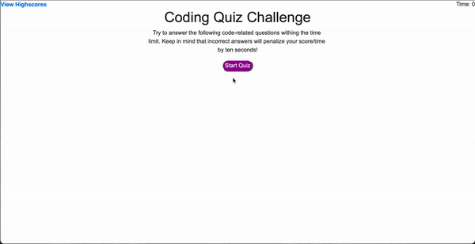

# Code-Quiz:
The purpose of this application is to allow users to take a quiz code regarding programming. The test will be timed for 60 seconds, users get additional time for answering correctly and time is deducted for wrong answers. At the end of the quiz, the overall score will be showed with a prompt to enter initials. 

# Demo:

# Features
- BootStrap
- CSS
- HTML
- Javascript

# Websites:
- Github Repo: https://github.com/KPetiote/Code-Quiz/

- Github Website: https://kpetiote.github.io/Code-Quiz/